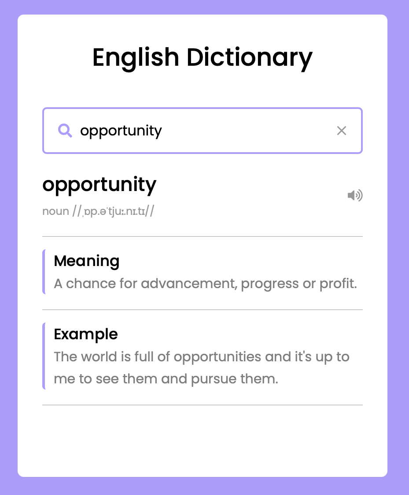

# Dictionary Application

## Link

https://scintillating-alfajores-8cc8f6.netlify.app/

## Overview

A web-based English dictionary application built with HTML, CSS, and JavaScript. The application allows users to search for words and retrieve their meanings, pronunciations, examples, and synonyms using the Free Dictionary API.

## Features

- Search for English words
- View word definitions
- Display pronunciation and part of speech
- Listen to audio pronunciation
- View example usage
- Browse synonyms
- Search directly from synonym results
- Clean and responsive user interface

## Technologies

- HTML5
- CSS3
- JavaScript (ES6)
- Free Dictionary API
- Font Awesome
- Google Material Icons

## Project Structure

```text
Dictionary-App/
│
├── index.html
├── dictionary.png
├── README.md
│
└── src/
    ├── index.js
    └── style.css
```

## Installation and Setup

### Clone the Repository

```bash
git clone https://github.com/Salmah1/Dictionary-App.git
cd Dictionary-App
```

### Run the Application

Open `index.html` in your web browser.

## How to Use

1. Enter a word into the search bar.
2. Press **Enter**.
3. View the word's:
   - Meaning
   - Pronunciation
   - Example sentence
   - Synonyms

4. Click the speaker icon to hear the pronunciation.
5. Click a synonym to perform a new search automatically.

## API

This project uses the Free Dictionary API:

https://dictionaryapi.dev/

## Screenshot


